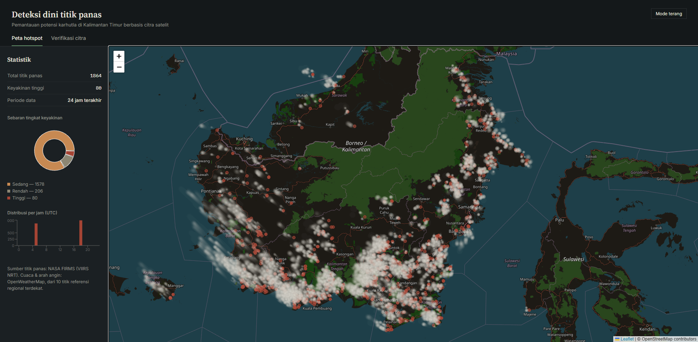

# Deteksi Dini Titik Panas (Wildfire WebGIS)


Aplikasi WebGIS untuk pemantauan potensi kebakaran hutan dan lahan (karhutla) di Kalimantan Timur berbasis citra satelit dan prediksi Machine Learning.
<br>
<br>
<br>
<br>
<br>
> [!CAUTION]
> # PERHATIAN PENTING: KETERBATASAN AKSES MOBILE
> Aplikasi ini tidak dapat diakses melalui perangkat mobile (HP). Proyek ini berjalan pada layanan hosting gratis dengan resource terbatas. Proses pemuatan awal (cold start), pengambilan data satelit NASA secara real-time, dan pemuatan model Machine Learning (.h5) ke dalam memori memerlukan resource besar. Harap gunakan PC atau Laptop untuk menghindari timeout atau crash.
<br>
<br>
<br>
<br>

## Fitur Utama
* Pemetaan interaktif sebaran titik panas di wilayah Kalimantan Timur.
* Penarikan data titik api secara real-time dari satelit NASA FIRMS (VIIRS NRT).
* Verifikasi tingkat keyakinan (confidence level) titik panas menggunakan model Machine Learning.
* Dasbor statistik (total titik panas, sebaran tingkat keyakinan, dan distribusi per jam).

## Tech Stack
* **Frontend:** React.js, Vite, Tailwind CSS, React-Leaflet (Deployment: Vercel)
* **Backend:** Python, TensorFlow/Keras, NASA FIRMS API (Deployment: Railway via Docker)

## Cara Menjalankan di Local

### 1. Backend
```bash
cd backend
python -m venv venv
source venv/bin/activate  # Untuk Windows: venv\Scripts\activate
pip install -r requirements.txt
python app.py
```

### 2. Frontend
```bash
cd frontend
npm install
# Buat file .env dan tambahkan URL backend lokal: VITE_API_URL=http://localhost:8000
npm run dev
```
<br><br>
#
<p align="center">
  <sub>
    Proyek ini menggunakan referensi dari 
    <a href="https://www.kaggle.com/code/vidhuran07/wildfire-prediction-dataset-satellite-images" target="_blank">
      Wildfire Prediction Dataset (Satellite Images) - Kaggle
    </a> 
    untuk melatih model Machine Learning.
  </sub>
</p>
